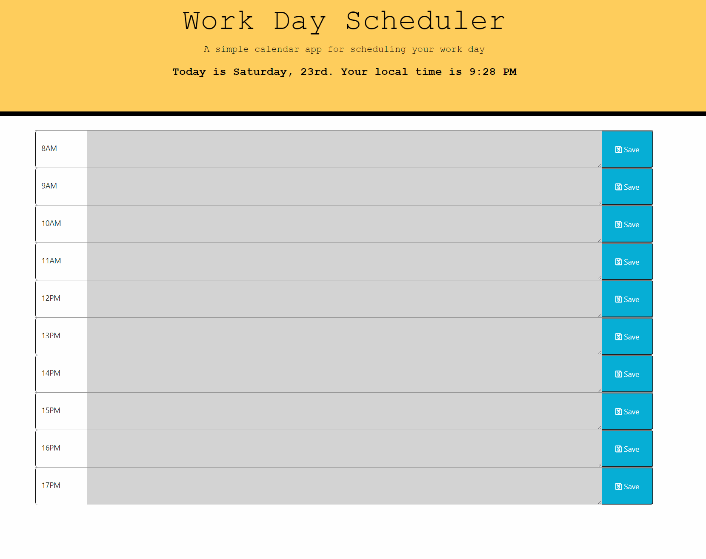

# How to use our daily 📆

 ❤️ The red highlighted area represents the current hour
 💚 The green highlighted area represents the future hours
 ❕ The grey highlighted area represents the past hours


# Technologies used 

- [x] HTML
- [x] Javascript
- [x] CSS
- [x] FontAwesome
- [x] Bootstrap
- [x] jQuery


# What I learned from this assignment 

* Pulling content from local storage to the DOM

* Practicing if, if else and else

* Learned to work with momentjs to define & display dates and hours

# Preview



## Important Change Log for errors / bugs while reviewing the code


* After hours of research this was the best way that I found  to approach the click function to send the content to the local storage.

```js
// This function makes the saveBtn store the text into our local storage

$(".saveBtn").click(function(){
    var taskId = $(this).attr("id")
    var taskItem = $("#" + taskId).val()
    localStorage.setItem(taskId, taskItem)
})
```
